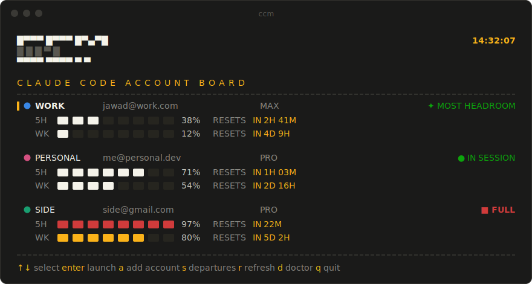

<div align="center">

# ccm

**The departure board for your Claude Code accounts.**

Unlimited named accounts. All running **at the same time**. Every quota on one board.

[](LICENSE)
[](package.json)
[](package.json)
[](https://github.com/Jawad-Adas/ccm/issues)



*A real full-screen terminal app — cells flip and settle left-to-right like a Solari airport board.*
*Dark-committed: departure boards have no light mode.*

</div>

---

## Why

You're deep in a session. The 5-hour window hits 100% and Claude stops mid-thought. You *have* a second account — but switching means logging out, logging back in, losing your place, and doing the same dance again two hours later.

ccm makes that wall visible before you hit it. Every account is a permanent, isolated profile — **launching is switching**. The board shows which account has headroom *before* you start, and because every profile is its own `CLAUDE_CONFIG_DIR`, any number of accounts run simultaneously in different terminals with no swap step and no shared state to corrupt.

If that's a problem you have, a ⭐ helps other multi-account people find this.

## 30-second start

```powershell
git clone https://github.com/Jawad-Adas/ccm && cd ccm
npm install -g .

ccm import work        # adopt your current ~/.claude login as profile "work"
ccm add personal       # opens Claude Code once — log in with account #2, then /exit
ccm                    # the board. pick a row, press enter.
```

Requires Node 18+ and Claude Code on PATH. **Zero dependencies.** Your `~/.claude` and the plain `claude` command are never touched — ccm is purely additive.

## What you get

- **Launching is switching.** `ccm work` starts Claude Code on the *work* account. `ccm personal` in another tab starts the second one. Both run at once.
- **The board.** Full-screen split-flap TUI: accounts as rows, quota windows as tile meters, amber reset clocks, status chips (`✦ MOST HEADROOM`, `▲ ALMOST FULL`, `■ FULL`). Add accounts, resume sessions, and run health checks without leaving it.
- **A web twin.** `ccm ui` serves the same board on `127.0.0.1` and launches accounts into Windows Terminal tabs.
- **Quota-aware picker.** Accounts sort most-headroom-first, so picking the account with room is the default gesture — switching stays your explicit choice.
- **Move a session across accounts.** Hit a limit mid-conversation? `ccm move-session personal` copies the session to another account and resumes it there. The original stays put.
- **Configure once.** Shared `settings.json`, `CLAUDE.md`, skills, agents, and MCP servers are composed into every profile at launch, with per-profile overrides (`ccm override work model=opus`).
- **Shared auto-memory.** What Claude learns about a repo is pooled across accounts — the memory follows the project, not the login.
- **Inside Claude Code too.** `ccm statusline install` shows `● work · 5h 43% · wk 12%` in your session — and when you near a limit, a `→ ccm move-session <best>` escape hatch right where you're looking.
- **Windows toasts** when any account crosses 80% / 95%, and again when a limit resets ("fresh again").
- **Pin an account to a folder.** `ccm pin work` — from then on, `ccm` in that folder (and subfolders) launches *work* directly.

## How it compares

| | log out / log in | hand-rolled `CLAUDE_CONFIG_DIR` | ccm |
|---|:---:|:---:|:---:|
| Accounts running simultaneously | ✗ | ✓ | ✓ |
| See quota before committing to an account | ✗ | ✗ | ✓ live board |
| Shared settings / skills / MCP across accounts | — | copy by hand | composed at launch |
| Move a live session to another account | ✗ | ✗ | `ccm move-session` |
| New account setup | repeat every switch | manual dirs + env vars | `ccm add name` |

## Commands

| Command | What it does |
|---|---|
| `ccm` | Launches the pinned account for this folder, or shows the board |
| `ccm <name> [args…]` | Launch that account; args pass through to `claude` |
| `ccm ui` | The board in your browser (local only, 127.0.0.1) |
| `ccm pick` | Force the picker (ignores any pin) |
| `ccm import [name]` | Adopt the current `~/.claude` login, including session history so `--resume` sees past conversations |
| `ccm add <name>` | New profile + first login |
| `ccm list` | Profiles at a glance (email, plan, running/last-used) |
| `ccm remove <name>` | Delete a profile (confirms; refuses if running) |
| `ccm status [--fresh\|--json]` | Usage bars, reset times, severity for every account |
| `ccm move-session <to> [id]` | Copy the latest session for this folder (or a given id) to another account and resume it there |
| `ccm override <name> [key=value…]` | Per-profile settings merged over the shared layer at launch |
| `ccm mcp list / share / unshare` | Shared MCP servers injected into every profile; a profile's own servers always win |
| `ccm doctor` | Health check: claude binary, tokens, junctions (auto-repairs), stale locks, integrations |
| `ccm notify on\|off\|test` | Windows toasts on 80% / 95% and on limit reset |
| `ccm wt install` | One Windows Terminal profile per account, colored tabs, auto-synced |
| `ccm pin <name>` / `ccm unpin` | This folder always uses that account |
| `ccm statusline install` | Live account + quota readout inside Claude Code |

## How it works

```
~/.ccm/
  config.json            profile registry
  cache/usage.json       cached quota data
  profiles/<name>/       a full CLAUDE_CONFIG_DIR: credentials, sessions, history
  shared/                settings.json, CLAUDE.md, agents/, skills/, commands/, hooks/
```

- **Shared config**: directories are junction-linked into every profile (no admin needed on Windows); `settings.json` / `CLAUDE.md` / MCP servers are *composed* into each profile at launch — shared base + per-profile overrides from `~/.ccm/overrides/`. A newer-mtime rule means changes made inside a session (`/config`) survive until the shared or override sources actually change.
- **Shared auto-memory**: per-project memory (`projects/<slug>/memory`) is pooled in `~/.ccm/shared/memory` and linked into every profile at launch. Originals are kept as `memory.bak` when first pooled. Opt an account out with `ccm override <name> memory=private`.
- **Quota data** comes from the same OAuth usage endpoint Claude Code's own `/usage` uses, fetched live when the board opens. ccm refreshes each profile's access token the way Claude Code does, so numbers are accurate even for accounts that aren't running. If a profile's token can't be refreshed, ccm borrows a valid token from another source on the same account (read-only, never rotated — usage is per-account, so the number is identical). Only when no live token exists anywhere does the board fall back to the last reading, clearly marked **stale** ("as of Xh ago") — never a stale number dressed up as live.
- **Session lists match `/resume`**: subagent / SDK transcripts (the many small files a workflow fan-out spawns) are hidden, so a folder with one real chat and 400 subagent runs shows one session, not 401.
- **Pinning**: `ccm pin work` writes a `.ccmrc`; `ccm` walks up from the current folder and auto-launches the nearest pin.

## FAQ

**Is this against Anthropic's ToS?**
ccm deliberately does **not** auto-rotate accounts when quota runs out — rotating to evade rate limits is against Anthropic's ToS. ccm shows you your accounts and their real usage; switching is always your explicit choice.

**Will it touch my existing `~/.claude`?**
Never. ccm is purely additive — `ccm import` *copies* your login into a profile; the original and the plain `claude` command keep working untouched.

**macOS / Linux?**
Built and daily-driven on Windows. The core (profiles, board, picker, quota, move-session) is plain Node with no Windows-only APIs, but other platforms are untested — Windows Terminal tabs and toast notifications are Windows-only. Reports and PRs welcome.

**What if Anthropic changes the usage endpoint?**
Only the quota columns degrade. Profiles, launching, session moves, and everything else keep working.

**Why zero dependencies?**
A tool that wraps your API credentials should be auditable in an afternoon. Every line that runs is in this repo.

---

<div align="center">

**If ccm ever saves you from a rate-limit wall, [⭐ star it](https://github.com/Jawad-Adas/ccm)** — it's how other multi-account people find it.

Found a bug or want your platform supported? [Open an issue.](https://github.com/Jawad-Adas/ccm/issues)

MIT © [Jawad Adas](https://github.com/Jawad-Adas)

</div>
